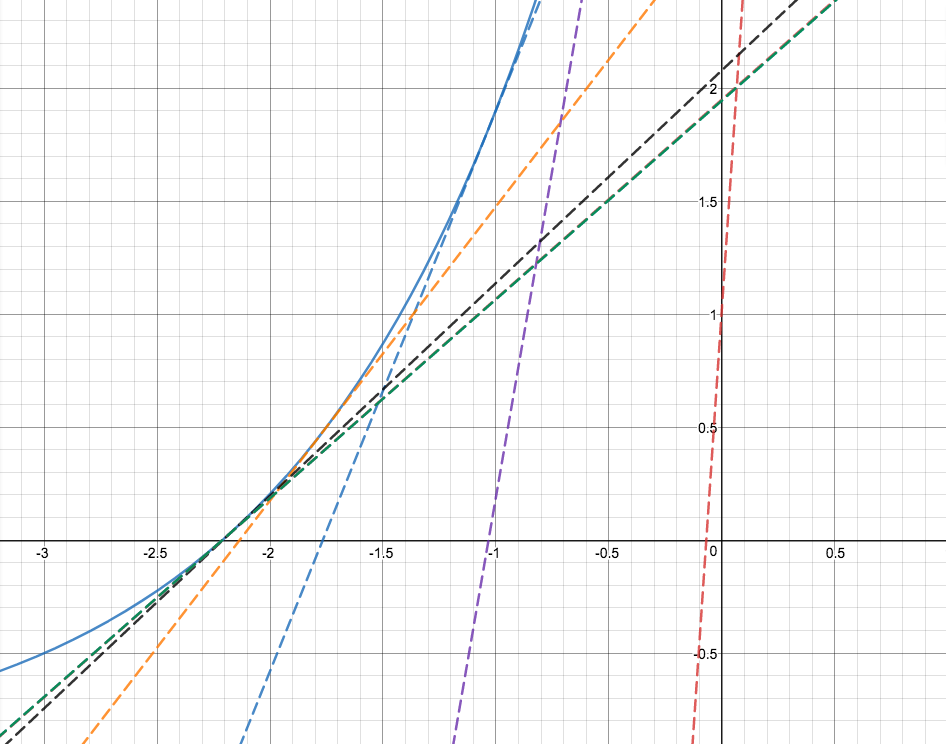
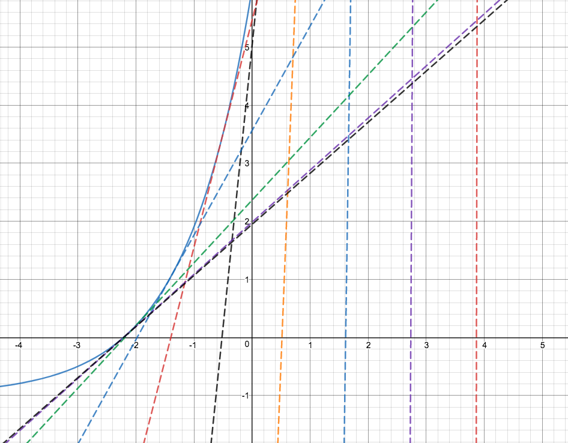
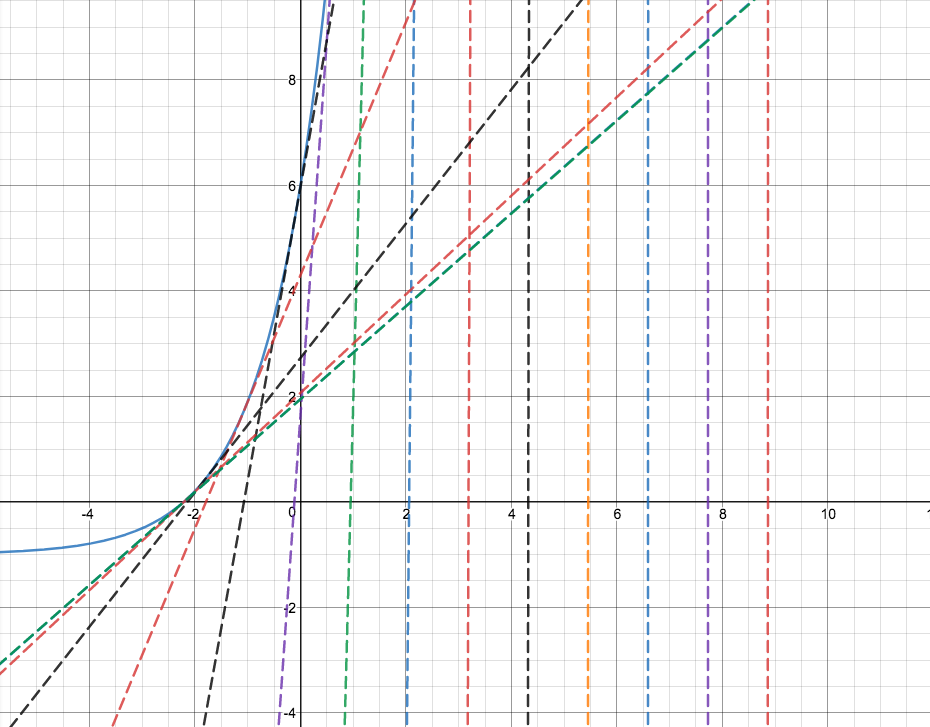

# Método de Newton
## O problema
No problema apresentado, temos a seguinte função de reaeração:
```
𝒄(𝒕) = 𝒄𝒔 − (𝒄𝒔 − 𝒄𝟎) 𝒆ˆ(𝑲𝒂*𝒕)
```
Onde
```
𝒄𝒔 = saturação da concentração de (OD)
𝒄𝟎 = inicial concentração de (OD)
𝑲𝒂 = taxa de reaeração
𝒕 = tempo ( em dias)
𝒄(𝒕) = concentração de (OD) no tempo t
```
É desejado saber o valor de t para que 𝒄(𝒕) seja igual a 8. Desta forma, a função que iremos aplicar o método de newton será:
```
f(t) = 8 - 𝒄𝒔 + (𝒄𝒔 − 𝒄𝟎) 𝒆ˆ(𝑲𝒂*𝒕)
```
Sendo assim, desejamos encontrar o ponto t quando f(t) = 0

## Implementação
A implementação do método de newton em python ficou desta maneira:
```python
class NewtonRaphson(object):
    def execute(self, fx, dfdx, guess, precision, maxIterations):
        """
        Executa o método de NewtonRaphson usando a função passada e sua derivada
        Permite também que sejam passados o chute inicial, a precisão e o número máximo de iterações
        """
        currentPrecision = precision+1
        iteration_counter = 0
        while currentPrecision >= precision and iteration_counter < maxIterations:
            try:
                nextGuess = guess - fx(guess)/dfdx(guess)
                print "Next guess: ", nextGuess
            except ZeroDivisionError:
                print "Error! - derivative zero for x = ", guess
                sys.exit(1) # Aborta com um erro

            currentPrecision = abs(guess-nextGuess) # Necessário para calcular a precisão -> | x_k+1 - x_k |
            guess = nextGuess
            iteration_counter += 1

        print "Num of iterations ", iteration_counter
        return guess
```
Desta forma, pode-se utilizar qualquer função usando esta mesma classe.
Para rodar a aplicação e o problema apresentado, foi criada a classe Application:

```python
class Application(object):
    cs = 9 # mg/l
    c0 = 2 # mg/l
    ka = 0.88 # /dia

    def __init__(self):
        print("Initializing NewtonRaphson application")
        t0 = int(raw_input("Enter the initial guess:"))
        newtonRaphson = NewtonRaphson()
        result = newtonRaphson.execute(self.f, self.dfdx, t0, 0.000001, 100)
        print "f(",result,") ~= 0"

    def f(self, x):
        print "Getting x = ",x
        fx = 8 - self.cs + ((self.cs - self.c0) * exp(self.ka * x))
        print "Getting fx = ",fx
        return fx

    def dfdx(self, x):
        dfdx = self.ka * (self.cs - self.c0) * exp(self.ka * x)
        print "Getting dfdx = ",dfdx
        return dfdx

Application()
```
Este será o arquivo que deverá ser executado. É nele que é definida a função f(x) e sua derivada dfdx(x).

## Análise
### Chute inicial t0 = 1
```console
t1:  -0.0690287481036
t2:  -1.03288780224
t3:  -1.76637908658
t4:  -2.13451047191
t5:  -2.20872699525
t6:  -2.21125870861
t7:  -2.21126153301
t8:  -2.21126153302
```
Número de iterações para se chegar a um resultado: 8

As linhas tracejadas representam as tangentes nas iterações
### Chute inicial igual a 5
```console
t1:  3.8656294383
t2:  2.73467404669
t3:  1.61294174355
t4:  0.515841388604
t5:  -0.517418258904
t6:  -1.39782563558
t7:  -1.97874679007
t8:  -2.18901648633
t9:  -2.2110452163
t10:  -2.21126151243
t11:  -2.21126153302
```
Número de iterações para se chegar a um resultado: 11

As linhas tracejadas representam as tangentes nas iterações
### Chute inicial igual a 10
```console
t1:  8.86366083329
t2:  7.72736371091
t3:  6.59118086773
t4:  5.45530859999
t5:  4.32028006461
t6:  3.18754134762
t7:  2.06099988165
t8:  0.951105890307
t9:  -0.114962419505
t10:  -1.07170571057
t11:  -1.79119721917
t12:  -2.14236588715
t13:  -2.20921460003
t14:  -2.21125969055
t15:  -2.21126153302
t16:  -2.21126153302
```
Número de iterações para se chegar a um resultado: 16

As linhas tracejadas representam as tangentes nas iterações
### Resultado Geral
Analisando esses 3 chutes iniciais distintos, percebe-se que quanto mais longe o chute inicial é do resultado final, mais iterações foram necessárias para se chegar a uma conclusão.
Diferentemente do que era esperado pelo exercício, foi possível encontrar uma solução para t0 = 10. Após rever diversas vezes a modelagem da função a ser analisada, não consegui identificar nenhuma falha na modelagem.